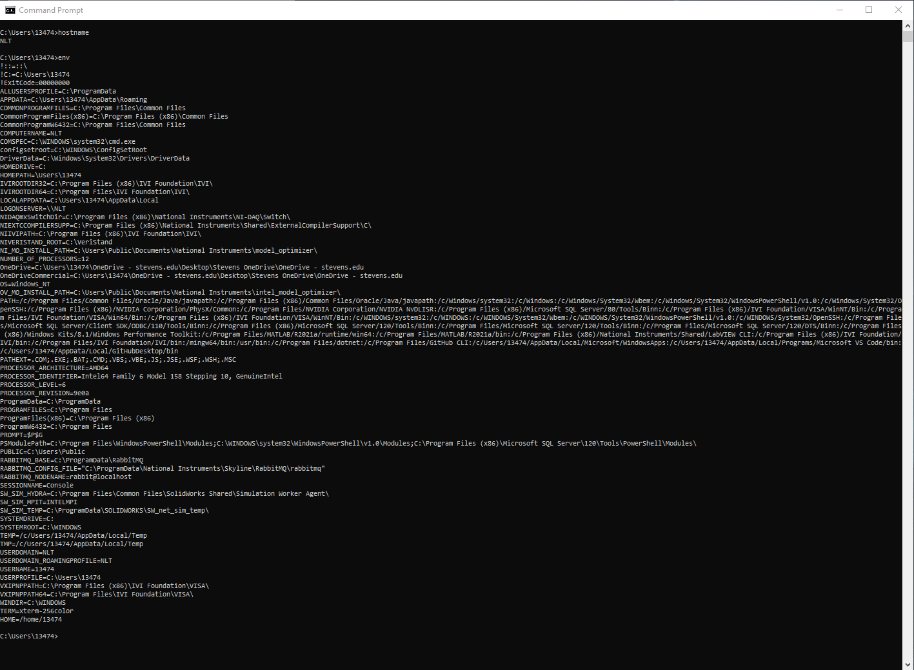
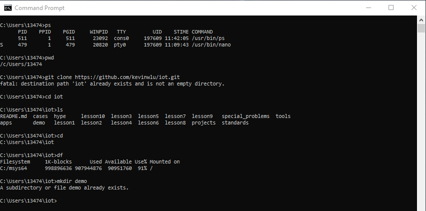
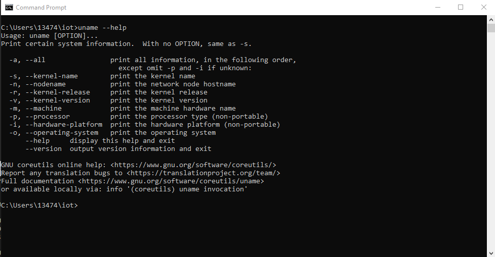
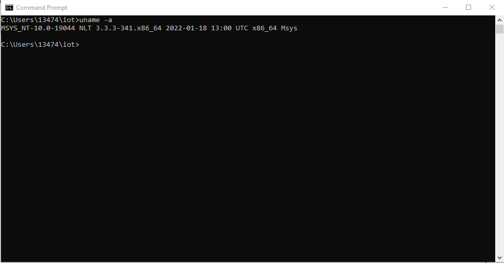
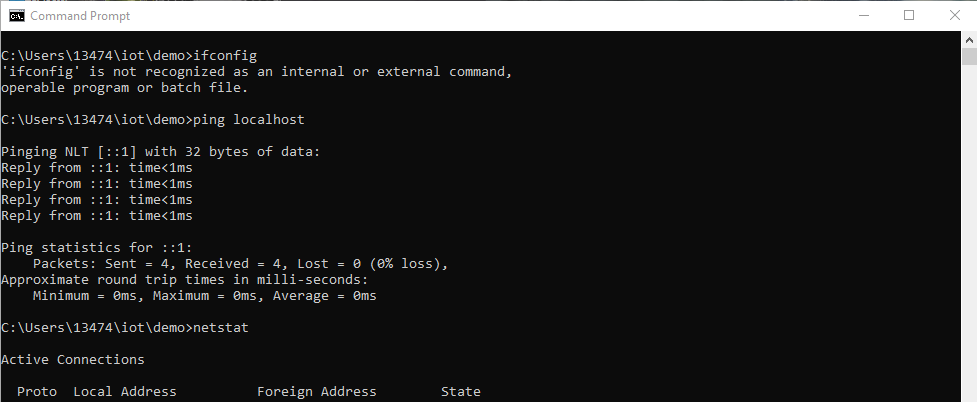

I pledge my honor that I have abided by the Stevens Honor System
# LAB 1 & 2
```ssh
$ hostname
$ env
```


```ssh
$ ps
$ pwd
$ cd iot
$ ls
$ cd
$ df
$ mkdir demo
```


```ssh
$ cd iot
$ ls
$ nano file
$ cat file
$ cp file file1
$ mv file file2
$ rm file2
```


```ssh
$ uname --help
```


```ssh
$ clear
$ uname -a
```


```ssh
$ ifconfig
$ ping localhost
$ netstat
```


